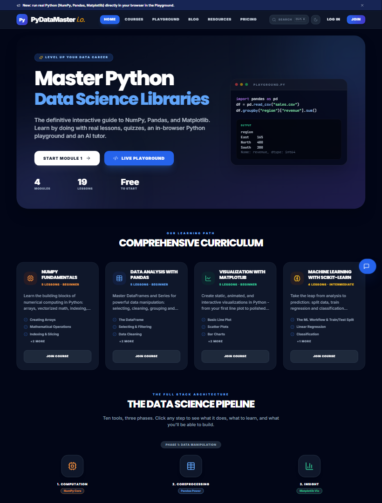
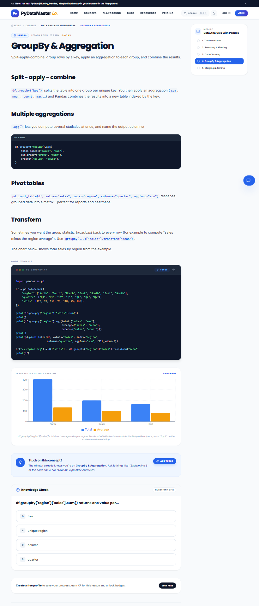
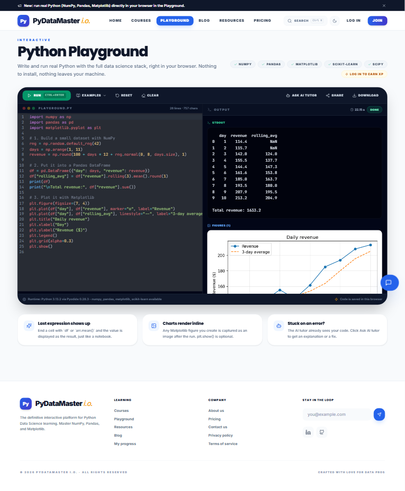
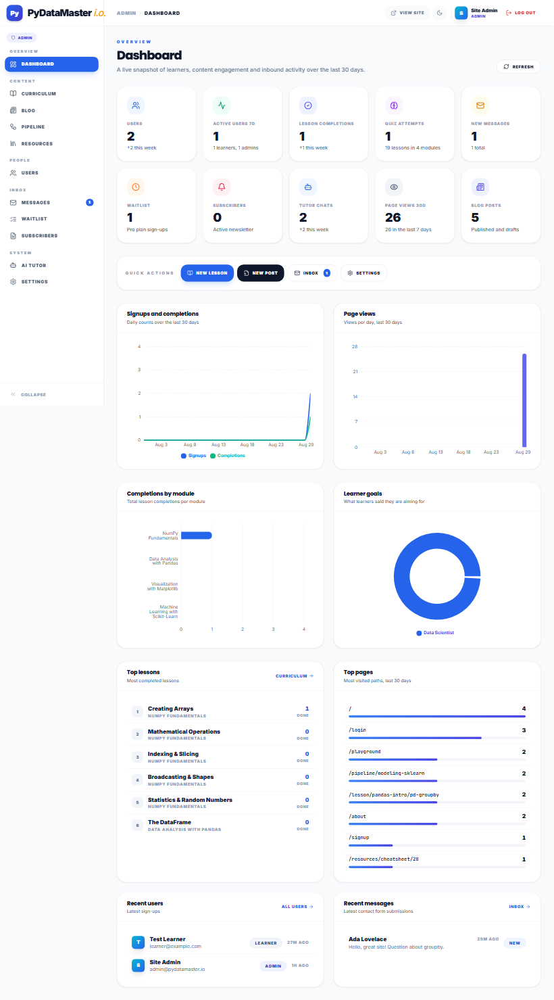
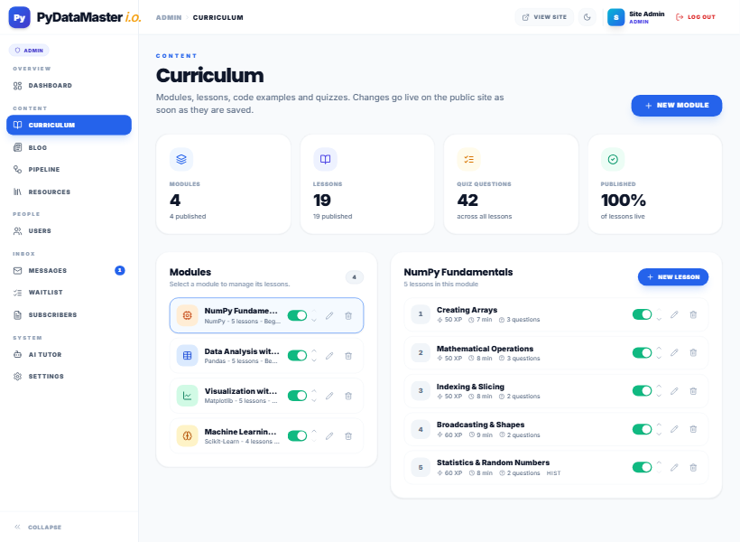
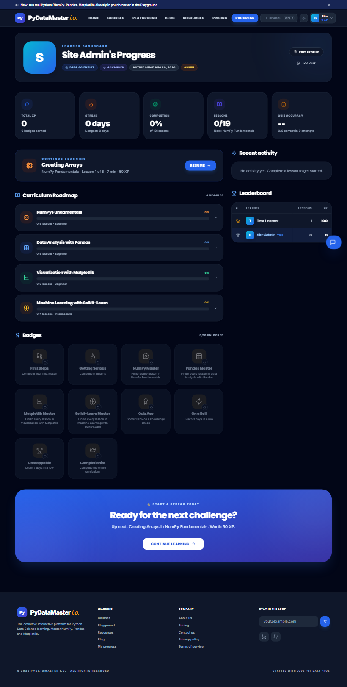

# PyDataMaster i.o.

An interactive Python data-science learning platform - a rebuilt and enhanced version of
[pydatamasterio.vercel.app](https://pydatamasterio.vercel.app/) with a real backend and a full admin panel.

## What's inside

**Learner site**

- 4 modules / 19 lessons (NumPy, Pandas, Matplotlib, Scikit-Learn) with markdown content, runnable code examples, interactive charts and quizzes
- In-browser **Python playground** (Pyodide: real NumPy, Pandas, Matplotlib, Scikit-Learn - no install)
- **AI Tutor** that knows which lesson / code you are looking at (Anthropic Claude by default, Gemini supported, offline curriculum-search fallback)
- Accounts with XP, streaks, badges, per-module progress, leaderboard
- Blog, Data Science Pipeline explorer (10 steps), resources + printable cheat sheets, pricing, contact & waitlist forms, global search (Ctrl+K), dark mode

**Admin panel** (`/admin`)

- Dashboard with KPIs and 30-day charts (sign-ups, completions, page views, tutor usage)
- Users (roles, suspend, reset password, progress view)
- Curriculum CMS (modules, lessons, code examples, quizzes, ordering, publish/draft)
- Blog, pipeline steps and resources editors
- Inbox for contact messages, waitlist + newsletter lists with CSV export
- Site settings (hero copy, announcement bar, features, pricing plans, social links, AdSense) and AI tutor configuration (provider, model, API keys, system prompt, test button)

## Screenshots

| Home (dark) | Lesson with quiz | Python playground |
| --- | --- | --- |
|  |  |  |

| Admin dashboard | Curriculum editor | Learner progress |
| --- | --- | --- |
|  |  |  |

More in [docs/screenshots](docs/screenshots/).

## Deployment

The whole product (site + admin + API + SQLite database) ships as **one Node server**, so it needs a host that runs
a long-lived process with a persistent disk. A production `Dockerfile` is included and configs are provided for the
most common hosts. Static-only platforms (Vercel/Netlify) are not suitable without swapping the database.

Environment variables (all optional except where noted):

| Variable | Purpose |
| --- | --- |
| `PORT` | listening port (hosts usually inject this) |
| `DB_PATH` | SQLite file location - point it at the persistent disk, e.g. `/data/pydatamaster.db` |
| `JWT_SECRET` | cookie signing secret (auto-generated and stored in the DB if omitted) |
| `ADMIN_EMAIL` / `ADMIN_PASSWORD` / `ADMIN_NAME` | first admin account, used only when the DB is created |
| `ANTHROPIC_API_KEY` (or `GEMINI_API_KEY`) | AI tutor provider key (can also be set in Admin -> Settings) |

### Option A - Railway (simplest)
1. Push this folder to a GitHub repository.
2. In Railway: **New Project -> Deploy from GitHub repo** (it picks up the `Dockerfile` via `railway.json`).
3. Service -> **Volumes -> Add volume**, mount path `/data`.
4. Service -> **Variables**: `DB_PATH=/data/pydatamaster.db`, `ADMIN_PASSWORD=<strong password>`, optionally `ANTHROPIC_API_KEY`.
5. Settings -> **Networking -> Generate domain**. Site is at `https://<domain>/`, admin at `https://<domain>/admin`.

### Option B - Render
1. Push to GitHub, then in Render choose **New -> Blueprint** and select the repo (`render.yaml` defines the service, disk and env vars).
2. Fill in `ADMIN_PASSWORD` (and `ANTHROPIC_API_KEY` if you have one) when prompted. Persistent disks require the Starter plan.

### Option C - Fly.io
```bash
fly launch --copy-config --no-deploy      # uses fly.toml
fly volumes create pdm_data --size 1
fly secrets set ADMIN_PASSWORD=... ANTHROPIC_API_KEY=...
fly deploy
```

### Option D - Any VPS with Docker
```bash
docker compose up -d --build              # serves on port 4000; put Caddy/Nginx in front for HTTPS
```

After the first boot, log in at `/admin` with the admin account and change its password under Admin -> Users.

## Stack

- `client/` - Vite, React 18, TypeScript, Tailwind CSS, react-router, Recharts, CodeMirror
- `server/` - Node 22+, Express, SQLite via the built-in `node:sqlite` module (no native build step), JWT cookies, bcrypt, zod, Anthropic SDK

## Run it

```bash
npm install          # installs both workspaces
npm run dev          # API on http://localhost:4000, site on http://localhost:5173
```

The database is created and seeded automatically on first start (`server/data/pydatamaster.db`).

Default admin account (change it in Admin -> Users after first login):

```
admin@pydatamaster.io / Admin@12345
```

### Production build

```bash
npm run build        # builds client/dist and server/dist
npm start            # serves API + built client on http://localhost:4000
```

### Configuration

Copy `.env.example` to `.env` (optional). Notable variables:

| Variable | Purpose |
| --- | --- |
| `PORT` | HTTP port (default 4000) |
| `JWT_SECRET` | Cookie signing secret (auto-generated and persisted if omitted) |
| `ADMIN_EMAIL` / `ADMIN_PASSWORD` / `ADMIN_NAME` | Initial admin account (first run only) |
| `ANTHROPIC_API_KEY` | AI tutor key (can also be set in Admin -> Settings -> AI Tutor) |
| `GEMINI_API_KEY` | Alternative provider key |
| `COOKIE_SECURE=1` | Set behind HTTPS in production |

Without any AI key the tutor still works in *curriculum mode* (it answers from lesson content).

### Useful scripts

```bash
npm run seed -w server            # re-seed empty tables / ensure admin exists
npm run seed -w server -- --force # reset all content tables to the defaults
npm run typecheck                 # TypeScript checks for both workspaces
```

## Project layout

```
client/src
  components/   layout, AI tutor, search, code block, charts, quiz, UI primitives
  context/      auth + site (settings, curriculum, theme) providers
  lib/          API client, types, markdown renderer, syntax highlighter, utils
  pages/        public pages (home, courses, lesson, playground, blog, ...)
  admin/        admin panel layout + pages
server/src
  index.ts      Express app (serves client/dist in production)
  db.ts         schema + migrations (node:sqlite)
  seed*.ts      default curriculum, posts, pipeline, resources
  routes/       auth, content, progress, forms, tutor, admin
```
