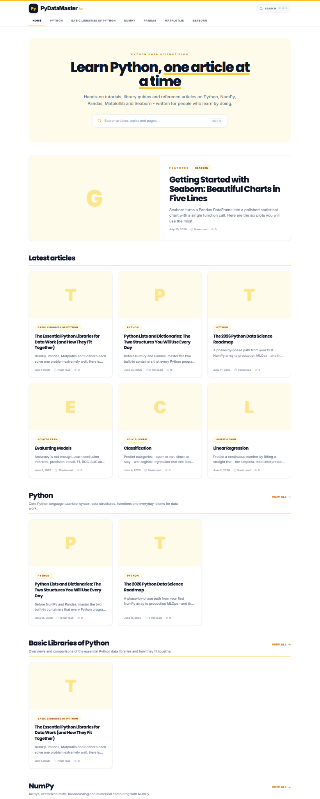
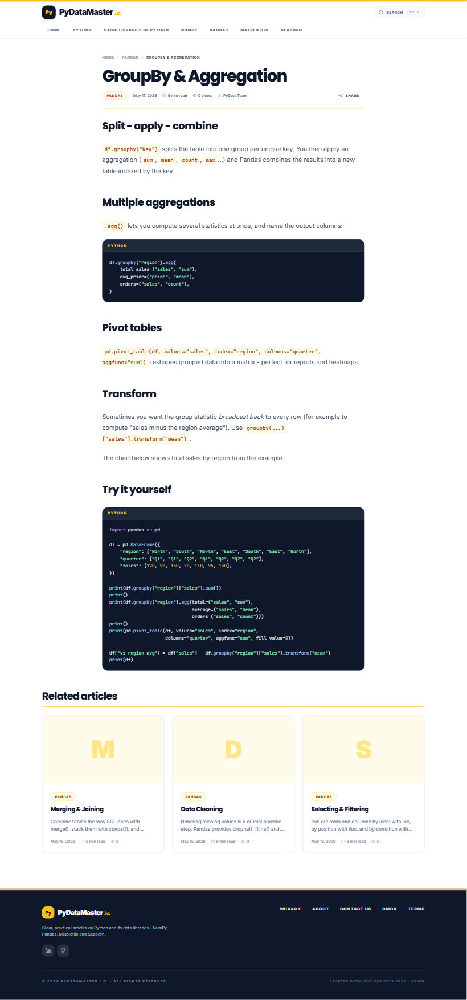
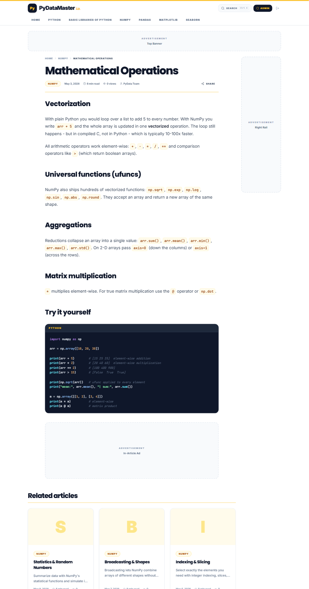
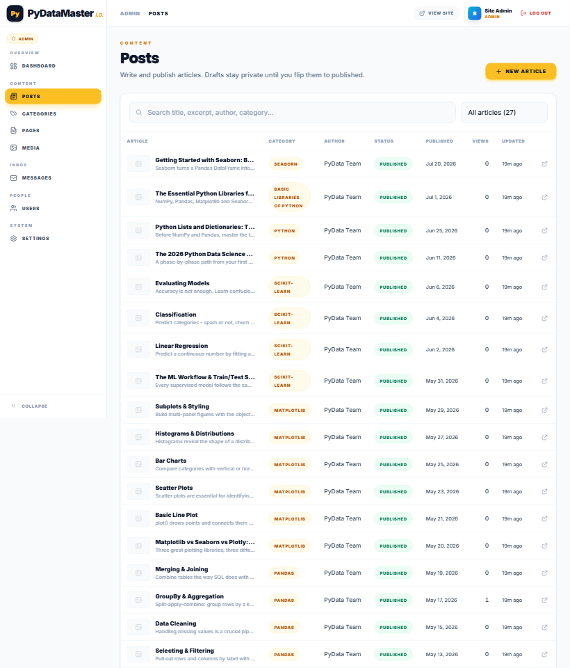
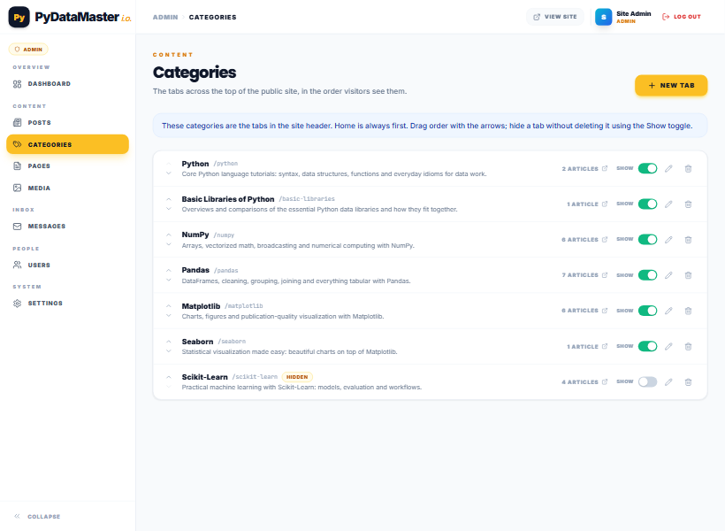

# PyDataMaster i.o.

A clean, white-and-yellow **Python tutorial blog** with a full admin CMS. Every part of the public site -
header tabs, articles, images, static pages, ads - is editable from the admin panel.

## What's inside

**Public site** (blog-style, inspired by digital-library layouts)

- Header tabs: **Home · Python · Basic Libraries of Python · NumPy · Pandas · Matplotlib · Seaborn** -
  the category tabs are managed from the admin panel (add, rename, reorder, hide)
- Home page with featured article, latest articles and one section per category - everything clicks through to content
- Article pages with cover images, markdown content (headings, tables, images, dark syntax-highlighted code blocks) and related articles
- Footer pages: **Privacy · About · Contact Us · DMCA · Terms** - all editable in the admin panel
- Working contact form, global search (Ctrl+K), mobile-friendly, light-only white + amber theme
- **Ad placements**: top banner, bottom banner, left rail, right rail and in-article - each can be switched on/off in settings
- 27 seeded articles across all categories (legacy lesson URLs redirect to their article versions)

**Admin CMS** (`/admin`)

- Dashboard: articles, page views (30-day chart), messages, users, most-viewed articles, articles per category
- **Posts**: markdown editor with live preview, category picker, cover image, "insert image" via the media library
- **Categories**: manage the header tabs (order, visibility, names) - changes appear on the live site immediately
- **Pages**: edit Privacy/About/DMCA/Terms/Contact (and add custom pages at `/p/<slug>`)
- **Media**: upload images (png/jpg/gif/webp, up to 8 MB), copy URL/markdown, delete
- Inbox for contact-form messages, user management, site settings (branding, announcement bar, social links, AdSense + ad placements)

## Screenshots

| Home | Article | Article with ads on |
| --- | --- | --- |
|  |  |  |

| Admin dashboard | Posts editor | Category tabs manager |
| --- | --- | --- |
|  |  |  |

More in [docs/screenshots](docs/screenshots/).

## Run it

```bash
npm install          # installs both workspaces
npm run dev          # API on http://localhost:4000, site on http://localhost:5173
```

The database is created and seeded automatically on first start (categories, pages, 27 articles, admin account).

Default admin account (change it in Admin -> Users after first login):

```
admin@pydatamaster.io / Admin@12345
```

### Production build

```bash
npm run build        # builds client/dist and server/dist
npm start            # serves everything on http://localhost:4000
```

## Deployment

The whole product (site + admin + API + SQLite database + uploaded images) ships as **one Node server**, so it
needs a host that runs a long-lived process with persistent storage. A production `Dockerfile` is included and
configs are provided for common hosts. Static-only platforms (Vercel/Netlify) are not suitable.

Environment variables (all optional):

| Variable | Purpose |
| --- | --- |
| `PORT` | listening port (hosts usually inject this) |
| `DB_PATH` | SQLite file location, e.g. `/data/pydatamaster.db` or `~/pydatamaster-data/pydatamaster.db`. Uploaded images are stored next to it in `uploads/`. |
| `JWT_SECRET` | cookie signing secret (auto-generated and stored in the DB if omitted) |
| `ADMIN_EMAIL` / `ADMIN_PASSWORD` / `ADMIN_NAME` | first admin account, used only when the DB is created |

### Option A - Hostinger (Node.js Web App, Business/Cloud plans)
1. hPanel -> **Websites -> Add Website -> Deploy Web App** -> Import Git Repository (or upload a ZIP of this folder).
2. Build settings: framework **Express** (or *Other*), **Node.js 24**, build command `npm run build`, entry file `index.mjs`.
3. Environment variables:
   - `DB_PATH=~/pydatamaster-data/pydatamaster.db` (keeps database + uploads outside the app folder so redeploys never wipe them)
   - `ADMIN_PASSWORD=<strong password>`
   - `NODE_OPTIONS=--no-warnings=ExperimentalWarning` (optional, silences the SQLite notice in logs)
4. Click **Deploy**. Site: `https://<your-domain>/`, admin: `https://<your-domain>/admin`.

### Option B - Railway
Deploy from GitHub (Dockerfile via `railway.json`), add a volume at `/data`, set `DB_PATH=/data/pydatamaster.db` and `ADMIN_PASSWORD`, generate a domain.

### Option C - Render
**New -> Blueprint** on the repo (`render.yaml` defines service, disk and env vars). Disks require the Starter plan.

### Option D - Fly.io
```bash
fly launch --copy-config --no-deploy
fly volumes create pdm_data --size 1
fly secrets set ADMIN_PASSWORD=...
fly deploy
```

### Option E - Any VPS with Docker (including Hostinger VPS via Docker Manager)
```bash
docker compose up -d --build              # serves on port 4000; put Caddy/Nginx in front for HTTPS
```

## Stack

- `client/` - Vite, React 18, TypeScript, Tailwind CSS (light-only white + amber theme), react-router, Recharts (admin charts)
- `server/` - Node 22.13+/24, Express, SQLite via the built-in `node:sqlite` module (no native build step), JWT cookies, bcrypt, zod

## Useful scripts

```bash
npm run seed -w server            # re-seed empty tables / ensure admin exists
npm run seed -w server -- --force # reset content tables to the defaults
npm run typecheck                 # TypeScript checks for both workspaces
```

## Project layout

```
client/src
  components/   layout (tabs header, footer, ads, search), blog cards, UI primitives
  context/      auth + site (settings, nav) providers
  lib/          API client, types, markdown renderer, syntax highlighter, utils
  pages/        Home, CategoryPage, PostPage, StaticPage, Contact, Login, NotFound
  admin/        admin CMS (dashboard, posts, categories, pages, media, inbox, users, settings)
server/src
  index.ts      Express app (serves client/dist and /uploads in production)
  db.ts         schema + migrations (node:sqlite) + uploads dir
  seed*.ts      categories, pages, articles (incl. lesson-to-article conversion)
  routes/       auth, content, forms, admin (posts/categories/pages/uploads/settings)
```
